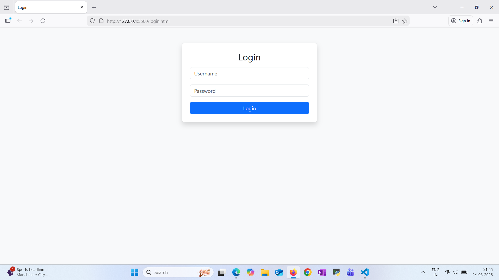
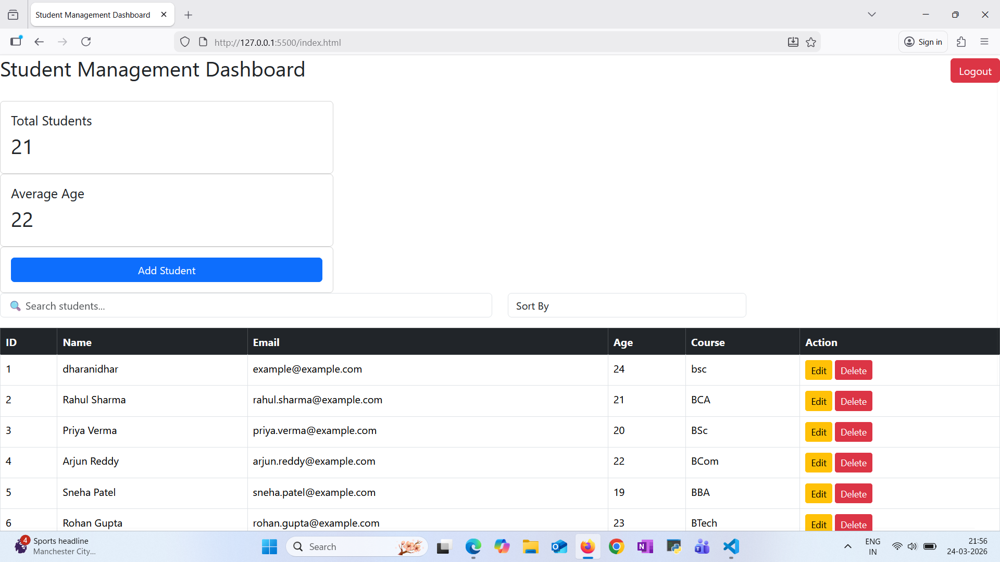
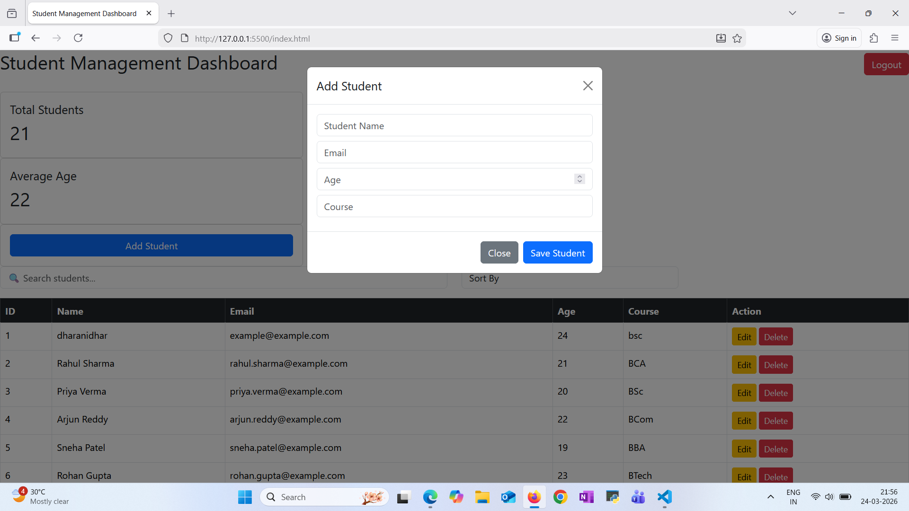
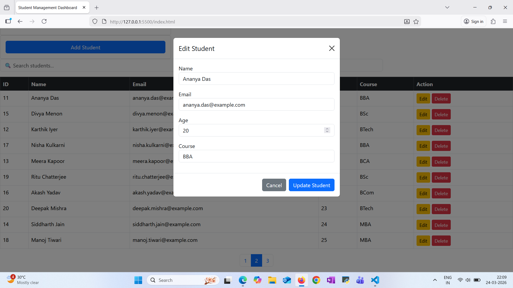
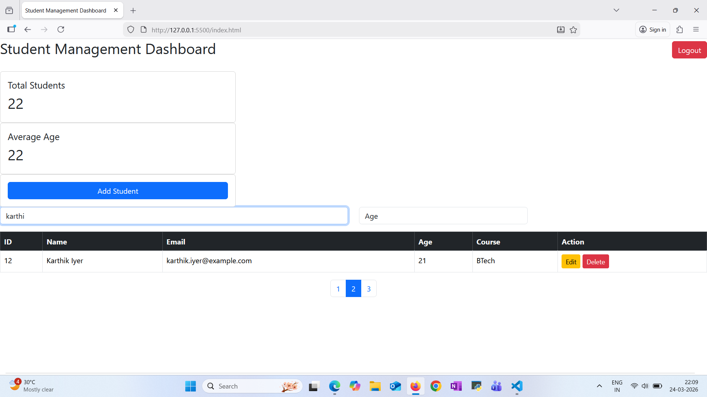
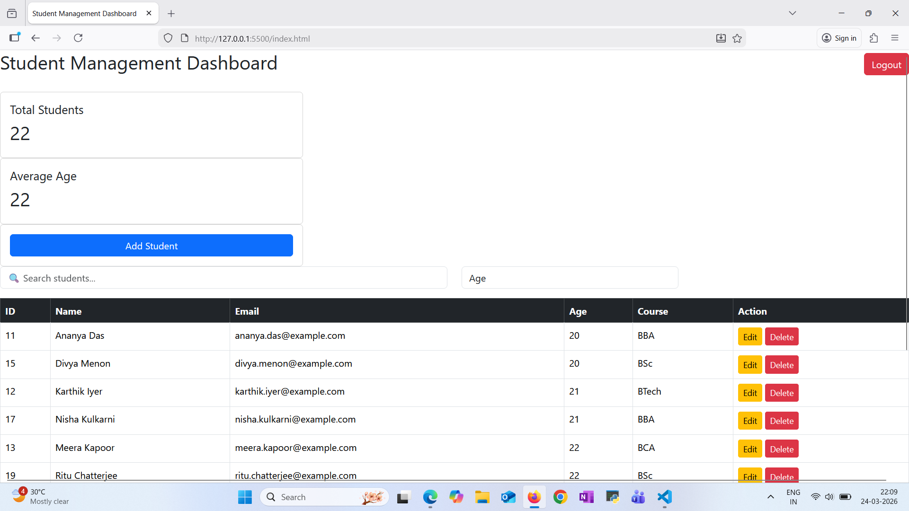

# Student Management System

A full-stack **Student Management Dashboard** built using **FastAPI and JavaScript**.
This application allows administrators to manage student records with features like authentication, CRUD operations, search, sorting, and pagination.

---

## 🚀 Features

* 🔐 JWT Authentication (Login / Logout)
* ➕ Add Students
* ✏️ Edit Student Details
* ❌ Delete Students
* 🔎 Live Search
* 🔃 Sorting
* 📄 Pagination
* 📊 Dashboard Statistics (Total Students & Average Age)
* 🔔 Toast Notifications
* ⏳ Loading Spinner

---

## 🛠 Tech Stack

Frontend

* HTML
* CSS
* JavaScript
* Bootstrap

Backend

* FastAPI
* Python
* SQLAlchemy

Database

* SQLite

Authentication

* JWT (JSON Web Tokens)

---

## 📸 Screenshots

### Login




### Dashboard



### Add Student



### Edit Student



### Search Student



### Sort Student 



---

## ⚙️ Installation

### 1️⃣ Clone the repository

```bash
git clone https://github.com/yourusername/student-management-system.git
cd student-management-system
```

### 2️⃣ Setup Backend

```bash
cd backend
python -m venv venv
venv\Scripts\activate
pip install -r requirements.txt
```

Run server:

```bash
uvicorn app.main:app --reload
```

Backend runs at:

```
http://127.0.0.1:8000
```

Swagger Docs:

```
http://127.0.0.1:8000/docs
```

---

### 3️⃣ Run Frontend

Open:

```
frontend/login.html
username:admin@example.com
password:1234
```

or run using Live Server in VS Code.

---

## 📡 API Endpoints

| Method | Endpoint       | Description    |
| ------ | -------------- | -------------- |
| POST   | /login         | User login     |
| GET    | /students      | Get students   |
| POST   | /students      | Add student    |
| PUT    | /students/{id} | Update student |
| DELETE | /students/{id} | Delete student |

---

## 📌 Future Improvements

* Add role-based authentication
* Export students to CSV

---
## Live Demo

Frontend:
https://student-management-system-t3gh.onrender.com

username:admin@example.com
password:1234

API Docs:
https://student-management-system-t3gh.onrender.com/docs

## 👨‍💻 Author

Dharanidhar Kotha
GitHub: https://github.com/Dharanidhar28

