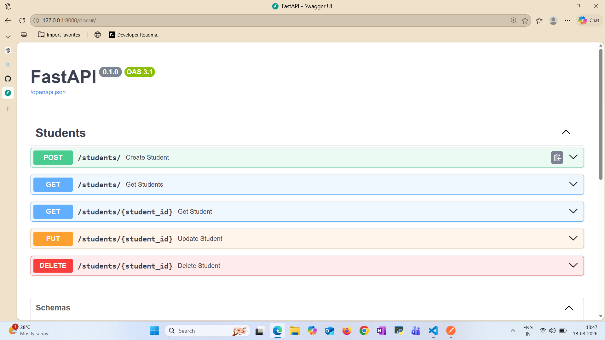
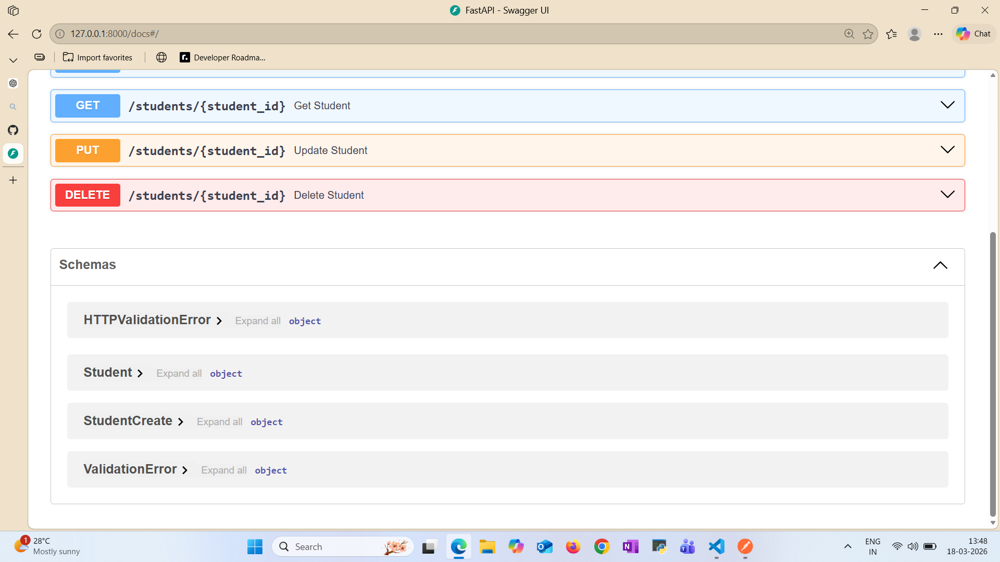
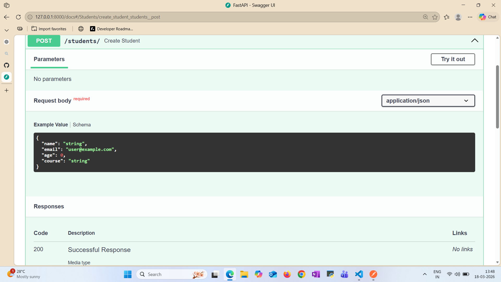
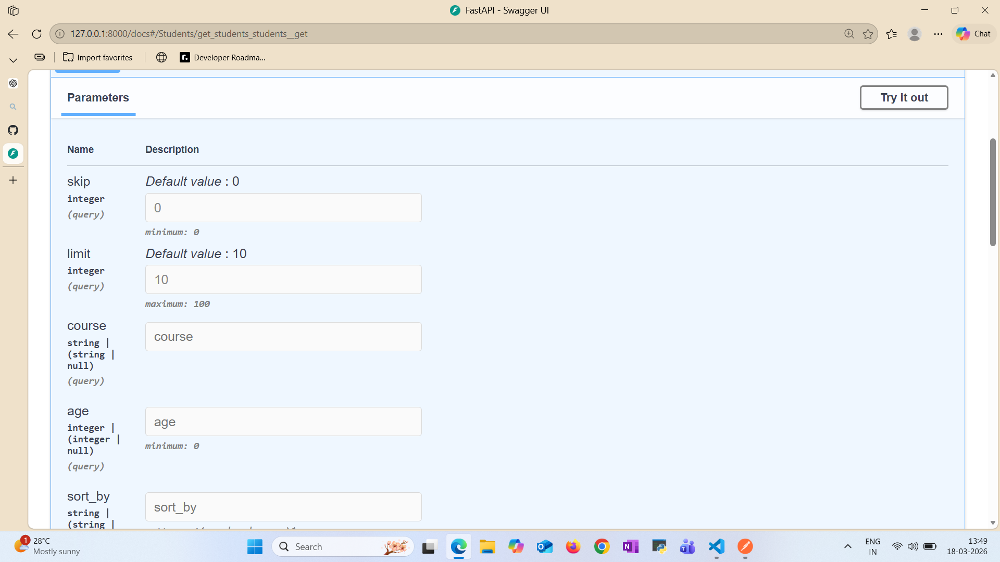
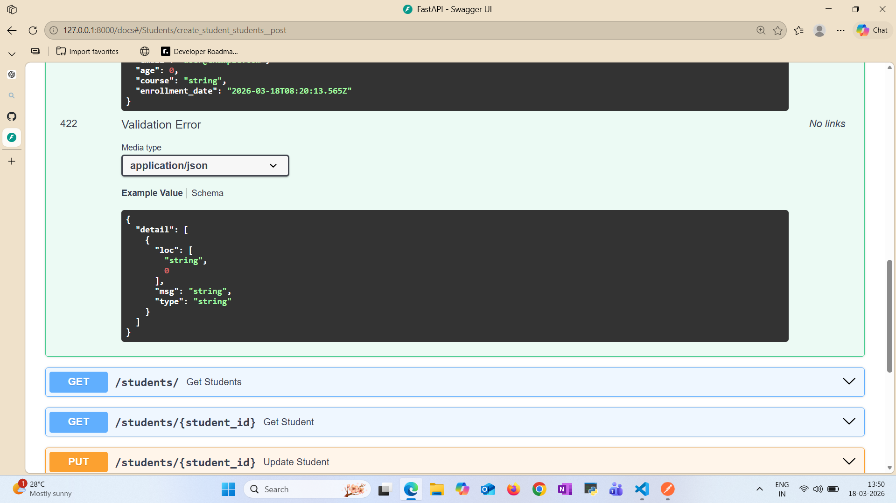

# Student Management System API

A RESTful API built using FastAPI to manage student records.  
The API allows users to create, retrieve, update, and delete student data with additional support for pagination, filtering, and sorting.

---

## Features

- Create student records
- Retrieve all students
- Retrieve a single student by ID
- Update student information
- Delete student records
- Pagination support
- Filtering
- Sorting

---

## Tech Stack

- FastAPI
- SQLAlchemy
- SQLite
- Pydantic

---

## Project Structure

app/
│
├── main.py            # FastAPI application entry point
├── database.py        # Database connection
├── models.py          # SQLAlchemy models
├── schemas.py         # Pydantic schemas
├── crud.py            # Database operations
└── routers/           # API routes

---

## Installation

Clone the repository

```bash
git clone https://github.com/YOUR_USERNAME/student-management-system.git
cd student-management-system
```

Install dependencies

```bash
pip install -r requirements.txt
```

Run the server

```bash
uvicorn app.main:app --reload
```

---

 ## API documentation

http://127.0.0.1:8000/docs

----

 ## Query Parameters

Pagination

GET /students?skip=0&limit=10

Sorting

GET /students?sort_by=age

Filtering

GET /students?name=John

### Swagger UI Preview







## Authentication

This API uses **JWT authentication**.

### Login

```
POST /login
```

Request:

```json
{
 "username": "admin@example.com",
 "password": "1234"
}
```

Response:

```json
{
 "access_token": "your_token_here",
 "token_type": "bearer"
}
```

### Using the Token

After login, click **Authorize** in Swagger and enter:

```
Bearer <your_token>
```

---

## Example Endpoints

### Get Students

```
GET /students
```

Query parameters:

```
skip=0
limit=10
course=Computer Science
age=21
sort_by=name
```

### Create Student

```
POST /students
```

Request:

```json
{
 "name": "Rahul Sharma",
 "email": "rahul@example.com",
 "age": 21,
 "course": "Computer Science"
}
```

---

## Future Improvements

- User registration
- Password hashing
- PostgreSQL database
- Docker deployment
- Cloud deployment


